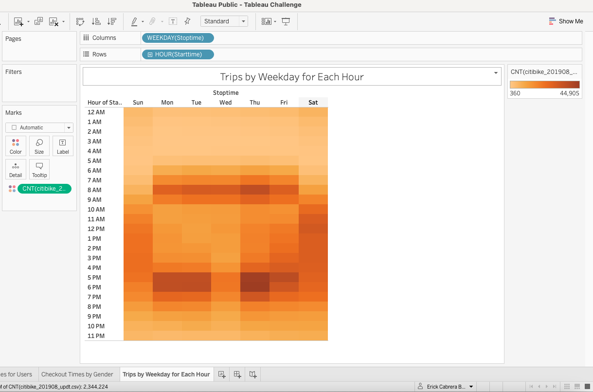

# Overview of the project

  There are important considerations to take into account while planning and presenting the project to bring a Bikesharing initiative to Des Moines, IA. Using the information obtained from the sample month of August 2019 we could observe important notations to share and make a case for the project.

# Bikesharing nature

  The idea of bike sharing is one that has been proven effective in large cities in the United States, not a small city itself, Des Moines may not be the most popular destination in the mid west, but the local office driven young professionals population could be a good nest for this initiative. Looking at the example of New Yor city may be a far fetch, but we can get signifficant information that even with lower volumes can tell us a lot about how the Bikesharing services are used.
  
## Location, Location, Location

  It seems to be evident by the darker sports in the lower Manhattan, that the downtown parts of the city drive a higher volume of rides. This of course may be influenced by the tourist flux, however, that area also happens to have the Wall Street district for the New York Stock Exchange (NYSE) market and other traffic driving offices. This tells our story from the perspective that bikes should be where the business is.
  
## The gender factor

  We do not believe there is a difference and it is not our job to determine the particular reasons why more men would take bike rides than women, but the analysis shows that the targeted demographic should be males, due to the overwhelming majority of male riders.
  
## A comute pattern

  The concentration of rides during week days, right before and around the start of office hours and right after and around the end of the work day, are a confirmation that most users are bound to an office schedule and indicate that the rides are used as part of the comute of users, maybe from and to office and train stations.

  Furthermore, we were able to make observations by gender, time and location of trips as can be observed below:
  
 
 
 
 
 
 
 
 
 
